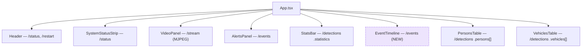
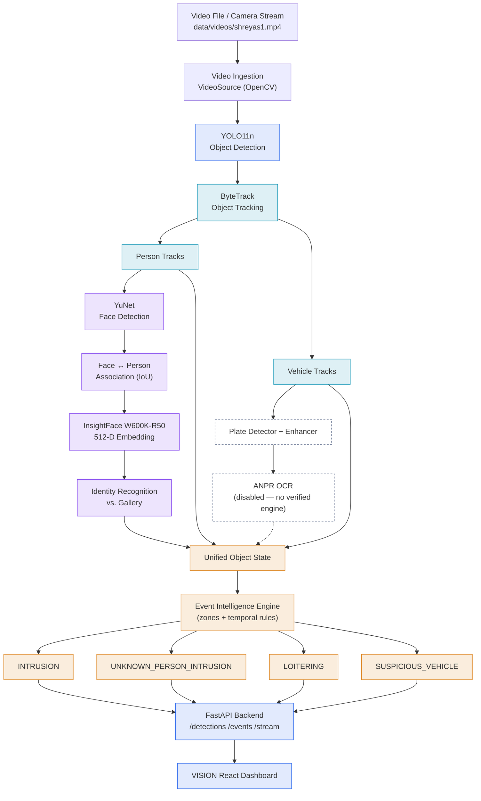
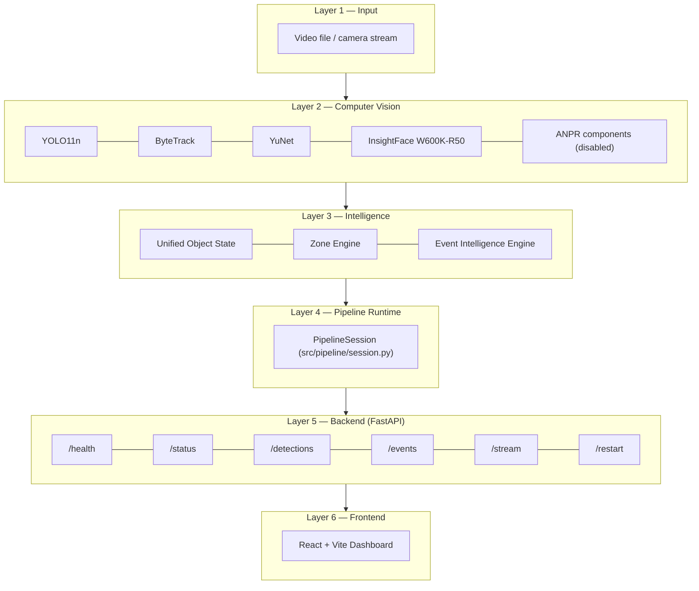
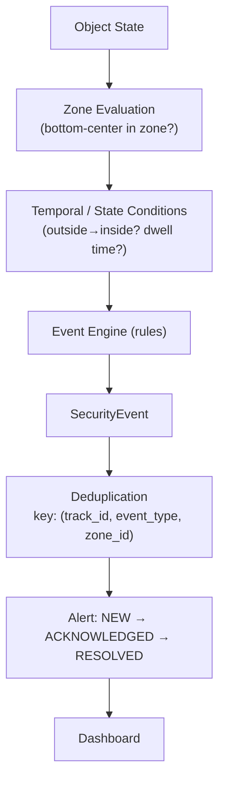

# VISION — Dashboard & System Design Specification

**Status:** Design / specification only. No pipeline, backend, or frontend code was changed to produce this document — every value, endpoint name, and field below is read from the frozen, verified implementation (142/142 tests passing, 3/3 live dashboard rehearsals passed). This is the build target for the next implementation pass, not a description of new code that already exists.

**Companion interactive version:** a high-fidelity HTML rendering of Section 1 (dashboard mockup, using a real captured frame) plus all diagrams below is published as a Claude Artifact for visual review. It is private to the author's account — ask for the link if you need it; this document is the durable, versioned source of truth.

Verified baseline this spec is built on:

| | |
|---|---|
| Pipeline | `YOLO11n → ByteTrack → YuNet → InsightFace W600K-R50 → Unified Object State → Event Engine` |
| Backend | FastAPI (`backend/main.py`) — no database, queue, or cloud infrastructure |
| Frontend | React + Vite (`frontend/`) |
| Golden demo video | `data/videos/shreyas1.mp4` |
| Golden zone config | `configs/zones_demo.yaml` |
| Demo events | `INTRUSION`, `LOITERING` (verified live; `UNKNOWN_PERSON_INTRUSION` and `SUSPICIOUS_VEHICLE` implemented but not demonstrated on the golden clip) |
| ANPR | Intentionally disabled — no verified OCR available (see [README.md](../README.md#anpr-decision-read-before-enabling)) |
| Identity states | `NO FACE` / `NOT RECOGNIZED` / `RECOGNIZED` — never "FLAGGED" |

Each section states: **what it represents**, **why it exists**, **what VISION component provides the data**, and its **status** — one of:

- 🟢 **LIVE** — implemented now, real data, no change needed
- 🟣 **NEW** — new UI treatment of data the backend already returns; zero backend change required
- ⚪ **FUTURE** — would require new backend work; explicitly out of scope for this phase

---

## 1. Final Dashboard Design

> **Represents:** the single judge-facing screen for the live SIH demo.
> **Why:** replaces the raw OpenCV debug HUD as the primary presentation surface.
> **Data source:** `GET /status`, `GET /detections`, `GET /events`, `GET /stream`.
> **Status:** 🟢 core panels · 🟣 event timeline & header clock.

Visual direction: dark navy/slate (`#0F172A` background, `#1E293B` panels), restrained blue accent (`#2563EB`), color reserved for status/alerts only — never decoration. Designed for a projector: high information density without clutter.

### A. Top header
`VISION` wordmark + `INTELLIGENT BORDER SURVEILLANCE` tagline (left) · backend-connection indicator, live clock, **Restart Demo** control, and the aggregate `● SYSTEM ONLINE` pill (right).

### B. Live surveillance area
Dominant panel (~2:1 width against the alerts column). Overlay is limited to: tracked person box + track ID, face box + identity/similarity label, zone polygon with breach highlight, camera tag (`BOP-01`). The dense engineering HUD (FPS, embedding dimensionality, thresholds) from the CLI is deliberately excluded here.

### C. Security alerts panel
Reserved for genuine Event Engine output only — a person merely failing face match never appears here (that's a Personnel-panel state). Each card: severity, event type, zone, track reference, timestamp, lifecycle status (`NEW`/`ACKNOWLEDGED`/`RESOLVED`, display-only — see §10).

### D. Personnel panel
One card per active person track: track ID, identity state, similarity when available, current zone. A small "state reference" strip documents the two non-live identity states (`NO FACE`, `NOT RECOGNIZED`) without presenting them as current data.

### E. Vehicle / ANPR panel
When `anpr_enabled=false`, plate fields are **absent from the payload**, not blank or "N/A" — the panel states the reason in plain language and clarifies that vehicle detection/tracking itself is independent and still active.

### F. System statistics
Five judge-facing tiles: `PERSONS · VEHICLES · FACES DETECTED · IDENTIFIED · ACTIVE ALERTS` — sourced directly from `/detections.statistics`, no invented metrics.

### G. Event timeline *(new)*
Same `/events` data as the Alerts panel, re-presented as a compact chronological log (`time · type · zone · track`) for scanning the full sequence rather than reacting to the newest alert.

### H. System status
Six pills, one per `/status` field, in the order the backend returns them: `VIDEO · DETECTION · TRACKING · FACE ID · ANPR · EVENTS`. `ANPR OFFLINE` renders in a muted "off" state — an honest state, not an error.

### I. Restart Demo
Small, secondary, ghost-button styling in the header — reads as a rehearsal control for the presenter, not a production action. Already functional via `POST /restart`; this phase only restyles it.

### Panel-by-panel status

| Panel | Status |
|---|---|
| Header (pill/restart) | 🟢 LIVE |
| Header clock | 🟣 NEW (client-side `Date`, no backend dependency) |
| System status strip | 🟢 LIVE |
| Live surveillance | 🟢 LIVE |
| Security alerts | 🟢 LIVE |
| Event timeline | 🟣 NEW (existing data, new component) |
| Personnel | 🟢 LIVE |
| Vehicles / ANPR | 🟢 LIVE |
| Restart Demo | 🟢 LIVE (visual refinement only) |

---

## 2. Component Hierarchy

> **Represents:** the React component tree backing Section 1.
> **Why:** a one-to-one build map for the next implementation pass.
> **Data source:** `frontend/src/App.tsx` + `frontend/src/components/`.
> **Status:** 7 existing components, 1 new.

All nodes except `EventTimeline` already exist in the codebase and only need the visual refinements from §1 applied.

---

## 3. Complete System Workflow

> **Represents:** the end-to-end path one video frame takes through every subsystem.
> **Why:** shows detection, face recognition, and ANPR as independent branches that only converge at Unified Object State.
> **Data source:** `src/pipeline/session.py`, `PipelineSession.process_frame()`.
> **Status:** 🟢 LIVE (ANPR branch present but disabled).

Object detection and face detection are separate stages; face recognition runs strictly after face detection and re-attaches to the person track that produced it. Every branch — person, vehicle, and ANPR — converges only at Unified Object State; the Event Engine never consumes a raw model output directly.

---

## 4. Technical Architecture

> **Represents:** the layered runtime architecture as actually deployed.
> **Why:** makes explicit what infrastructure does *not* exist.
> **Data source:** `src/`, `backend/`, `frontend/`.
> **Status:** 🟢 LIVE — no layer below is aspirational.

Six layers, one process each for the pipeline + backend, one dev-server process for the frontend. No database, message queue, container orchestration, or cloud service sits anywhere in this stack — `PipelineSession` holds all state in process memory, and the FastAPI layer is a thin read-only view over it plus one restart action.

---

## 5. AI Processing Flow — Per Frame

> **Represents:** everything that happens to one video frame, in order.
> **Why:** separates Detection / Tracking / Recognition / Event Intelligence as distinct, sequential phases.
> **Data source:** `PipelineSession.process_frame()`.
> **Status:** 🟢 LIVE — all steps run every frame.

| # | Step | Phase |
|---|---|---|
| 1 | Read frame from `VideoSource` | Ingest |
| 2 | YOLO11n detects objects (person / vehicle classes) | **Detection** |
| 3 | ByteTrack assigns / maintains persistent track IDs | **Tracking** |
| 4 | Person tracks isolated from vehicle tracks | **Tracking** |
| 5 | YuNet searches each person crop for faces | **Recognition** |
| 6 | Face detection associated back to its person track (IoU) | **Recognition** |
| 7 | InsightFace generates a 512-D L2-normalized embedding | **Recognition** |
| 8 | Embedding compared against the identity gallery (cosine + margin) | **Recognition** |
| 9 | Identity state produced: no-face / not-recognized / recognized | **Recognition** |
| 10 | Unified Object State updated (person + face + identity + plate) | **Event Intelligence** |
| 11 | Zone membership evaluated (point-in-polygon on ground position) | **Event Intelligence** |
| 12 | Event Engine evaluates temporal / transition conditions | **Event Intelligence** |
| 13 | Current state serialized to the API JSON contract | Deliver |
| 14 | FastAPI exposes the state on `/detections` and `/events` | Deliver |
| 15 | React dashboard polls and renders it (~500ms interval) | Deliver |

Steps 3–9 (Tracking + Recognition) only run on person tracks; a vehicle track skips directly from step 4 to step 10 with `identity=None`. The ANPR branch (vehicle → plate → OCR) sits parallel to steps 5–9 and is currently disabled, so vehicle Object States always carry `plate=None` today.

---

## 6. Event Intelligence Flow

> **Represents:** how a raw Object State becomes a dashboard alert.
> **Why:** shows the Event Engine is deterministic and rule-based, not a black box.
> **Data source:** `src/events/engine.py`.
> **Status:** 🟢 LIVE — alert *display* only; interactive Acknowledge/Resolve is ⚪ FUTURE (see §10).

Every stage is a pure function of the current Object State and a small amount of per-track memory (zone entry time, position history) — no ML model runs inside the Event Engine. Deduplication keys on `(track_id, event_type, zone_id)`, so the same person cannot spam the same alert every frame while they remain inside a zone.

### The four implemented event types

All four fire from the same deterministic engine — none involve a separate ML model or heuristic scoring.

| Event | Severity | Condition | Source |
|---|---|---|---|
| `INTRUSION` | HIGH | Transition **outside → inside** a `restricted` zone. Already being inside does not re-fire it — only the crossing does. | `EventType.INTRUSION` |
| `UNKNOWN_PERSON_INTRUSION` | HIGH | Face **was detected** and identity is **UNKNOWN** (no gallery match), on entry to a restricted zone. A person with no face detected at all never triggers this. | requires `has_face_detected=True` |
| `LOITERING` | MEDIUM | **Continuous dwell** inside a restricted zone reaches the configured duration (demo default: 3s, because the golden clip is only ~4.3s of video). Suppressed until exit + re-entry. | `--loitering-duration` |
| `SUSPICIOUS_VEHICLE` | MEDIUM | Vehicle displacement stays **below a pixel threshold** for a configured duration inside a restricted/warning zone. Not demonstrated in the golden clip — it contains no vehicles. | `--movement-threshold` / `--stationary-duration` |

---

## 7. Demo Storyboard

> **Represents:** a ~2:10 presenter script for the live SIH demo.
> **Why:** keeps narration paced to what the dashboard is actually doing.
> **Data source:** verified against 3 live rehearsals (Phase 5).
> **Status:** ✅ verified timing.

**Presenter tip, grounded in rehearsal:** click **Restart Demo** a few seconds before beginning the narration below — `INTRUSION` fires within ~1s of the loop restarting, and `LOITERING` follows ~13–15s later in every rehearsal run, which is what the 0:50 / 1:10 beats assume.

| Time | Scene | Narration |
|---|---|---|
| 0:00 | Open the dashboard | *"This is VISION, an intelligent border surveillance platform that converts conventional surveillance video into actionable security intelligence."* |
| 0:10 | Point to the live surveillance panel | *"The system detects and tracks objects continuously — this is a real annotated video feed, not a recording being replayed."* |
| 0:20 | Person box + track ID visible | *"Each detected person receives a persistent tracking identity — track #01 stays #01 across every frame they remain in view."* |
| 0:30 | Face box appears inside the person box | *"The face pipeline runs independently of object detection, and associates facial information back to the tracked person."* |
| 0:40 | Identity label + similarity appear | *"The system compares the facial embedding against the authorized identity gallery — here, a 71% match to Shreyas_Chavan."* |
| 0:50 | `INTRUSION` fires (HIGH, red) | *"The Event Intelligence Engine detects the transition into a restricted zone and automatically raises a high-severity intrusion alert."* |
| 1:10 | `LOITERING` fires (MEDIUM, amber) | *"The engine also reasons over time — this lets it recognize prolonged presence, not just react to a single frame."* |
| 1:30 | Pan to stats bar + event timeline | *"All of this intelligence is exposed through one unified command dashboard — statistics, tracked personnel, and a full event timeline."* |
| 1:50 | *(optional)* Cut to §3 workflow diagram if a technical judge asks | Hold in reserve rather than presenting by default. |
| 2:10 | Close | *"VISION transforms passive CCTV footage into an intelligent surveillance system capable of detection, tracking, identification, and automated security-event generation."* |

---

## 8. SIH Presentation Visual Structure

> **Represents:** the 5-slide deck skeleton for the SIH panel.
> **Why:** each slide reuses a figure already defined above — no new diagrams needed.
> **Status:** 🟣 NEW deck, existing assets.

| Slide | Title | Main visual | Reuses |
|---|---|---|---|
| 1 | Proposed Solution + Workflow | §1 dashboard mockup + §3 workflow (simplified) | §1, §3 |
| 2 | Technical Architecture | §4 layered architecture | §4 — state plainly: no DB / queue / cloud |
| 3 | AI / Computer Vision Pipeline | §5 steps 2–9 only (Detection → Recognition) | §5, trimmed |
| 4 | Event Intelligence | §6 spine + the 4 condition rows | §6 in full |
| 5 | Demo / Results | Live dashboard screenshot + real event timestamps | §1 — pair with the live demo, not a substitute for it |

---

## 9. Design System

**Color** — reserved for status and alerts only, never decoration:

| Token | Hex | Usage |
|---|---|---|
| Background | `#0F172A` | Dashboard base |
| Panel | `#1E293B` | Cards, panels |
| Accent | `#2563EB` | Interactive elements, live indicator |
| Success | `#22C55E` | `RECOGNIZED`, `ONLINE` |
| Warning | `#F59E0B` | `MEDIUM` severity, `LOITERING` |
| Danger | `#EF4444` | `HIGH` severity, `INTRUSION` |

**Typography** — two typefaces, two jobs: **IBM Plex Sans** for every label and sentence (technical, government-adjacent character rather than decorative), **IBM Plex Mono** reserved for anything that is literally data — track IDs, similarity scores, timestamps, endpoint paths — so a judge's eye learns to read monospace as "this is a measured value."

**Spacing scale:** `4 · 8 · 12 · 16 · 24 · 32` px.

**Identity-state badges** (never "FLAGGED"):

| State | Meaning |
|---|---|
| `RECOGNIZED` | face detected, matched the gallery |
| `NOT RECOGNIZED` | face detected, did **not** match the gallery |
| `NO FACE` | no face detected on this track at all |

**Icons:** none — no icon library is introduced. State is communicated with colored dots, severity-colored left borders, and short mono labels, matching what's already built rather than adding a new dependency for a cosmetic upgrade.

---

## 10. UI Element → Backend Data Mapping

Every element proposed above, traced to its real source. "🟣 NEW" means: no backend change required, only a new frontend presentation of a field the API already returns.

| UI element | Backend source | Status | Note |
|---|---|---|---|
| System status pill / strip | `GET /status` | 🟢 LIVE | 6 booleans, rendered verbatim — no synthetic "Pipeline"/"Backend" fields invented |
| Header clock | — | 🟣 NEW | Client-side `Date` tick, no backend dependency |
| Backend-connected indicator | Poll success/failure | 🟢 LIVE | Already derived client-side in `api.ts`'s `connected` state |
| Restart Demo control | `POST /restart` | 🟢 LIVE | Function exists; this phase only restyles it as a secondary control |
| Live surveillance video | `GET /stream` | 🟢 LIVE | MJPEG of frames annotated by the existing `draw_annotations()` |
| Security Alerts panel | `GET /events` | 🟢 LIVE | severity, title, message, status, timestamp, zone_name, track_id |
| Event Timeline | `GET /events` | 🟣 NEW | Same payload as Alerts, re-sorted/re-rendered as a compact log |
| Stats bar (5 tiles) | `GET /detections .statistics` | 🟢 LIVE | persons, vehicles, faces_detected, recognized_faces, active_events |
| Personnel cards | `GET /detections .persons[]` | 🟢 LIVE | track_id, identity, face_similarity, bbox, confidence, zone |
| Identity state legend (3 states) | Derived from `identity` field | 🟢 LIVE | `null`=no face, `"UNKNOWN"`=not recognized, name=recognized — already correct in `PersonsTable.tsx` |
| Vehicle / ANPR panel | `GET /detections .vehicles[]`, `.anpr_enabled` | 🟢 LIVE | Plate fields fully absent from the payload when disabled — never rendered as blank/"N/A" |
| Alert Acknowledge / Resolve controls | *no endpoint exists* | ⚪ FUTURE | `status` is already in the payload for display; changing it needs a new `POST` endpoint. Out of scope for this phase |
| Multi-camera selector | — | ⚪ FUTURE | One `PipelineSession`, one video, by design. Not proposed here |
| Historical event search / date range | — | ⚪ FUTURE | `/events` returns only the last 20 in-memory alerts; no persistence layer to query |

---

*End of specification. No code was modified to produce this document.*
